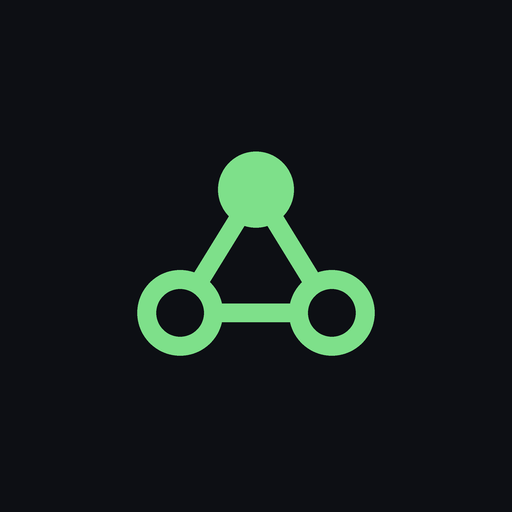
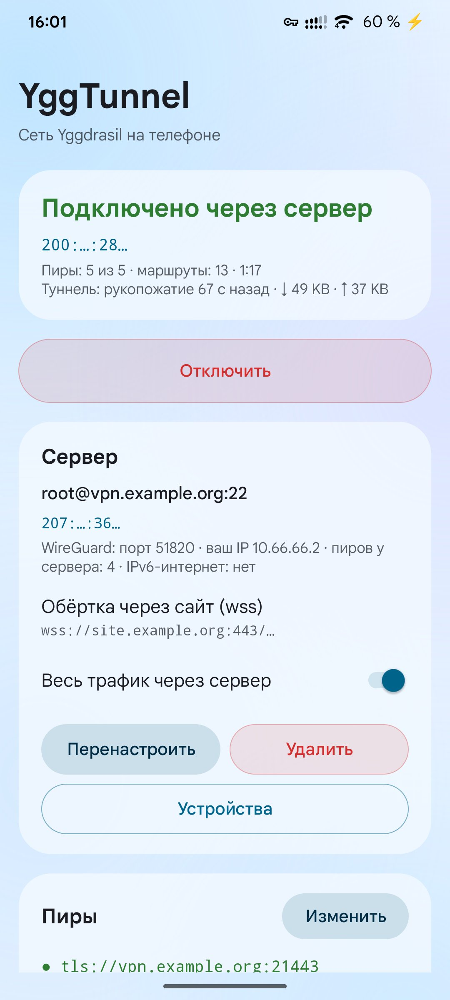
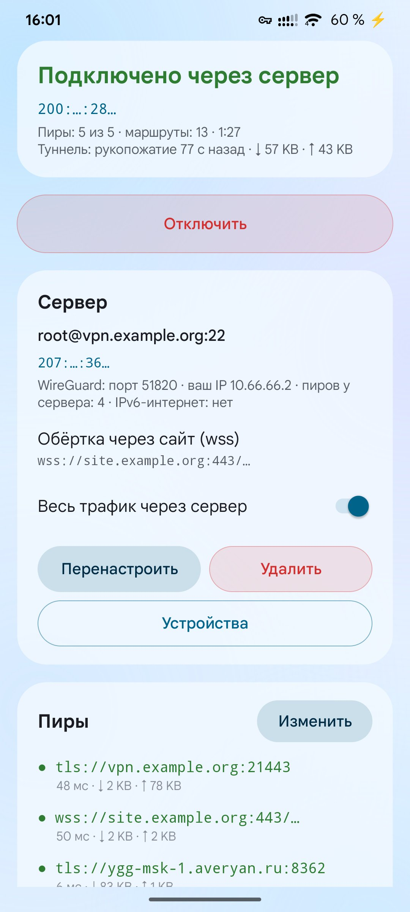
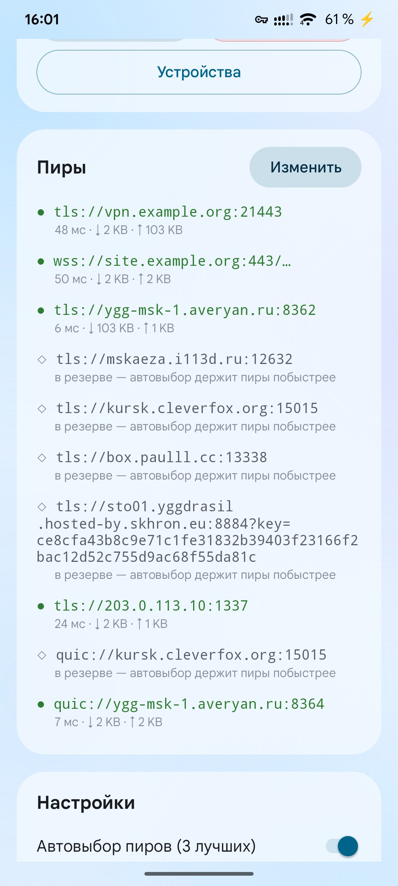
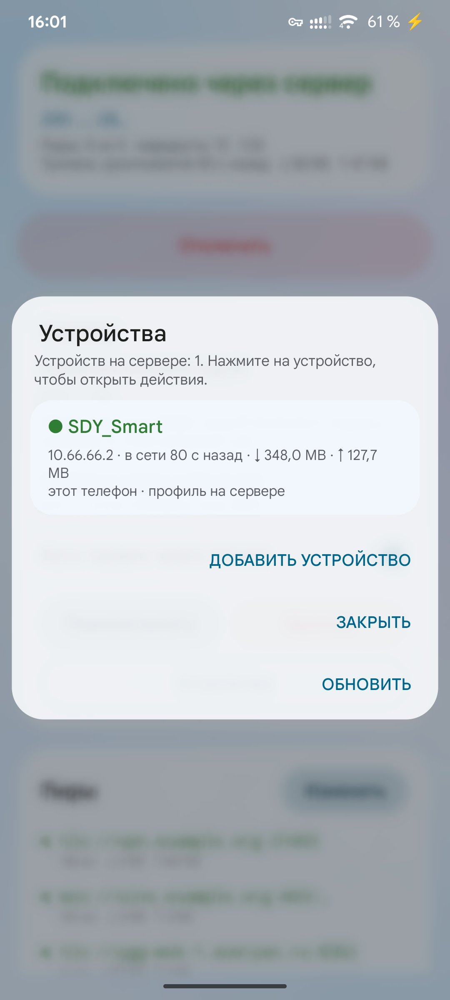
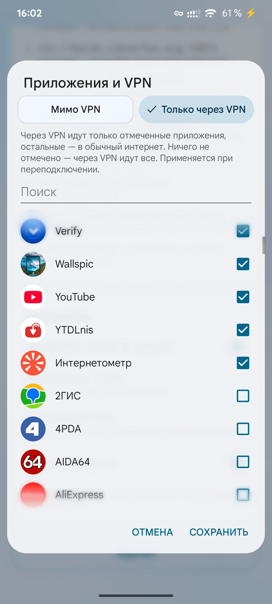
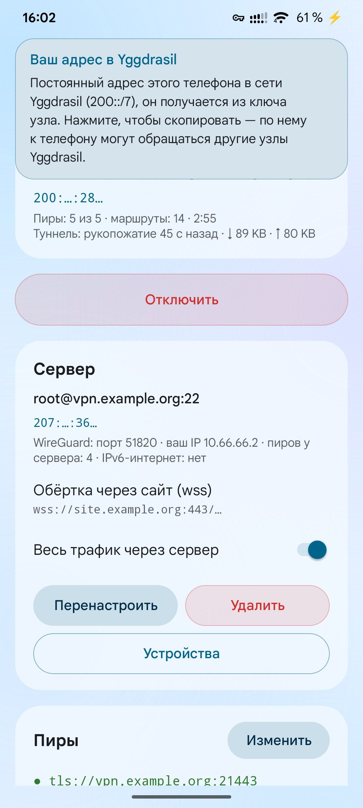

# 🌳 YggTunnel

[](https://github.com/Xtratter/yggtunnel/actions/workflows/build.yml)

[Русский](README.ru.md) · **English**

**Linux:** a desktop client (daemon + command line, window in progress) is being built in [`linux/`](linux/README.md).

An Android app that reaches **your own server through the [Yggdrasil](https://yggdrasil-network.github.io/) network**
and, step by step, turns it into a full VPN — in the spirit of AmneziaVPN, but with Yggdrasil as the transport.
The phone does not talk to your server directly: it joins Yggdrasil through public peers (TLS, QUIC, WebSocket),
so the tunnel does not depend on a direct connection to the server's address.

> [!NOTE]
> Early stage. Version 0.4: server setup over SSH from the app, the full tunnel through it, peer auto-pick, per-app routing (whitelist / blacklist), device admin with QR profiles.

## Screenshots

| Connected via the server | Server and wrapper | Peers |
|:---:|:---:|:---:|
|  |  |  |
| **Devices** | **Apps and the VPN** | **Long-press help** |
|  |  |  |

## How it is built

```
apps → TUN → wireguard-go ──UDP/IPv6──▶ yggdrasil-go ──TLS/QUIC/WSS──▶ public peers ──▶ your server ──▶ internet
       (0.0.0.0/0, ::/0)        (in-process)                                   (yggdrasil + WireGuard + NAT)
```

- The native core (`go/`) is Go: [yggdrasil-go](https://github.com/yggdrasil-network/yggdrasil-go) with a small
  hand-written JNI layer, built into `libygg.so` with `go build -buildmode=c-shared` — no gomobile, so it
  builds right in Termux with Termux clang, and on a regular machine with the Android NDK.
- The app (`app/`) is Kotlin without libraries: `VpnService`, one screen on
  [android-ui-kit](https://github.com/Xtratter/android-ui-kit) (Material 3 Expressive).

## Roadmap

| Version | What |
|---|---|
| 0.1 | Yggdrasil client: connect, address, peers with latency and traffic, log |
| 0.2 | Server setup over SSH from the app (key, custom port) like AmneziaVPN: Yggdrasil, WireGuard, NAT |
| 0.3 | Full tunnel: WireGuard inside Yggdrasil to your server |
| 0.4 | Peer manager with auto-pick, QR profiles, per-app routing |
| 0.5 | Device admin (names, online, traffic, remove), per-app whitelist / blacklist |
| 0.6 | Always-on VPN, Quick Settings tile, peers from the public catalog (phone and server) |
| 0.7 | Peering wrapper: wss through your own HTTPS site on the server |
| **0.8** | The wrapper sets itself up: existing nginx site (also behind telemt / xray on 443) or a new site with Let's Encrypt |

## Download

[Releases](https://github.com/Xtratter/yggtunnel/releases): `YggTunnel-vX.Y.apk` — arm64 phones (most), `YggTunnel-vX.Y-universal.apk` — any device (arm64, 32-bit ARM, x86_64).

## Build

Termux (see [termux-android-build](https://github.com/Xtratter/termux-android-build)) needs `pkg install golang`
in addition; elsewhere — Go 1.25+ and the Android NDK (`ANDROID_NDK_HOME`). Then:

```sh
./gradlew assembleRelease   # runs go/build.sh first (Gradle task buildGo)
```

**Patched dependency:** ironwood (Yggdrasil's routing core) is a patched copy in `go/third_party/ironwood`
— it only adds a pending-bytes counter for the parallel links; yggdrasil-go itself is unmodified.
Read [go/third_party/PATCHES.md](go/third_party/PATCHES.md) before updating yggdrasil-go or ironwood.

## License

GPL-3.0. Yggdrasil is LGPL-3.0.
